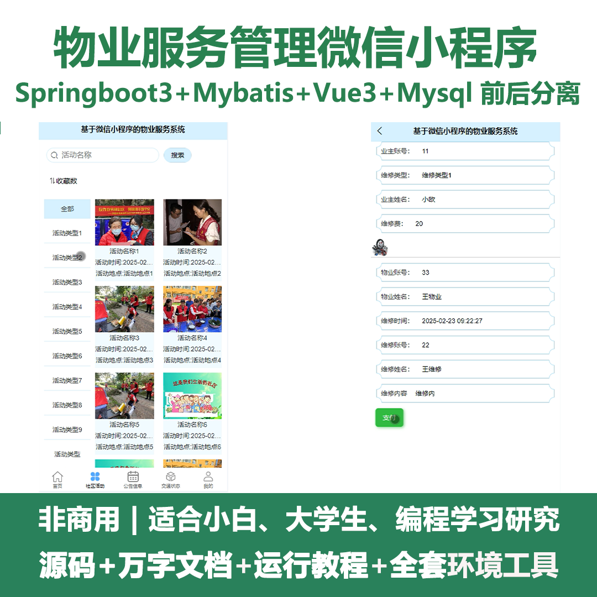
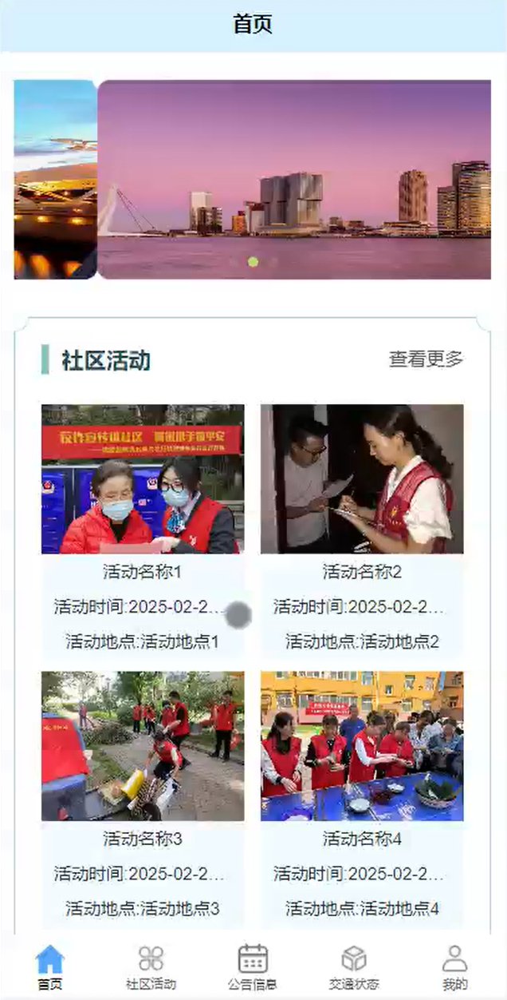
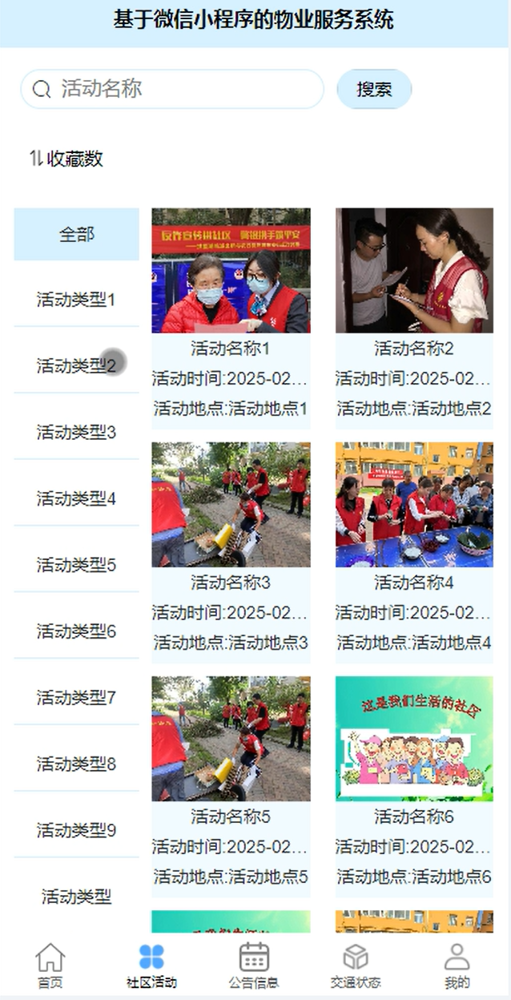
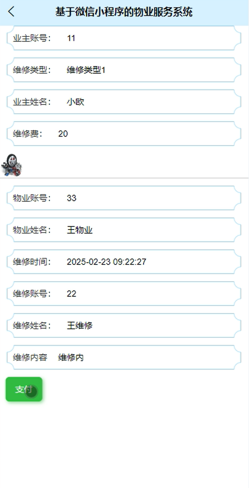
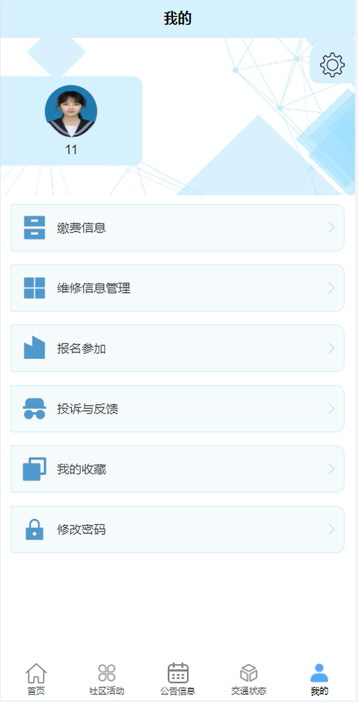
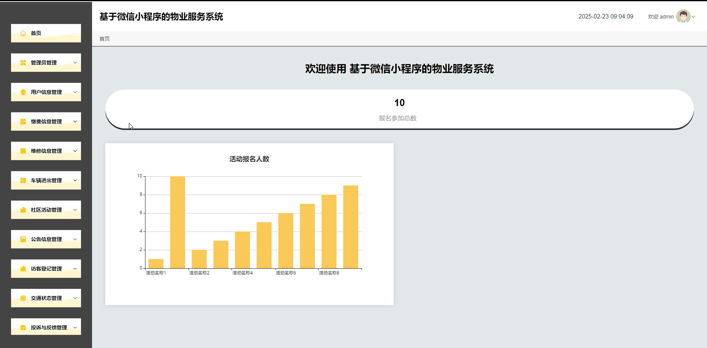
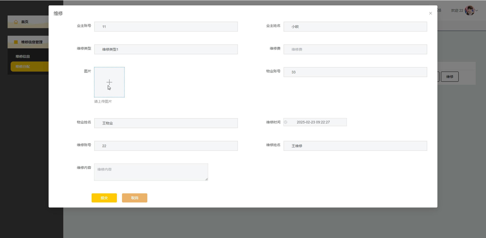
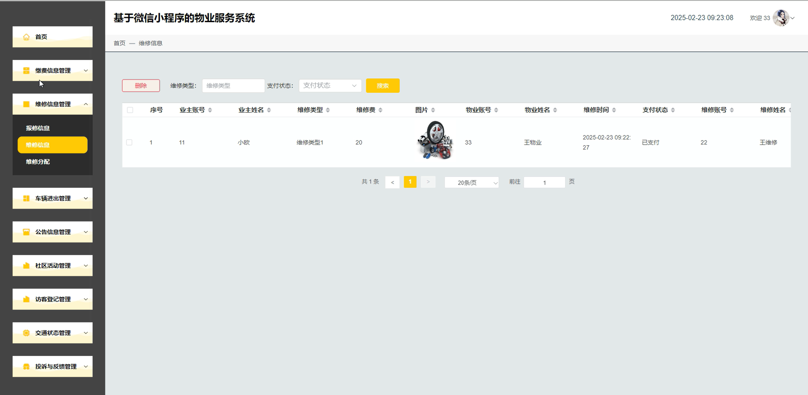
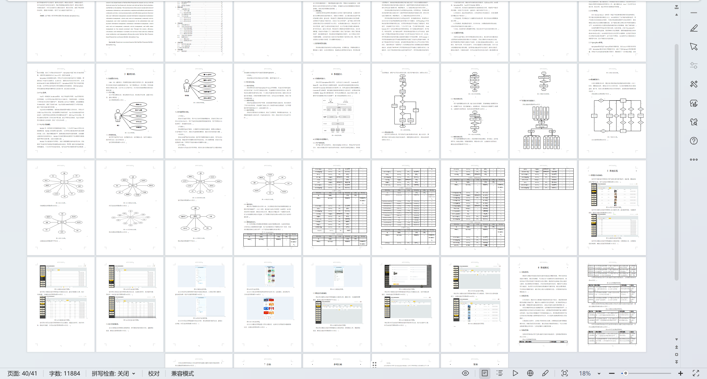

# mpweixinA202D
mpweixinA202D物业服务管理微信小程序+LW
 
## 源码问题查看主页咨询

### 一、关键词
缴费信息管理，维修信息管理，社区活动管理

### 二、作品包含
源码+数据库+万字设计文档+全套环境和工具资源+本地部署教程

### 三、项目技术
前端技术： Html、Css、Js、Vue3.0、Element-plus
后端技术：Java、SpringBoot3.0、MyBatis

### 四、运行环境（以下版本亲测，其他版本兼容性请自行测试）
开发工具：IDEA/eclipse  + VSCODE + 微信开发者工具

数据库：MySQL5.7（最低要5.7版本）

数据库管理工具：Navicat10以上版本

环境配置软件： JDK17 + Maven3.6.3

前端Nodejs：20

浏览器：谷歌浏览器

### 五、项目介绍
项目编号：mpweixinA202D

物业服务管理微信小程序可让业主便捷享受缴费、报修、获取社区通知等服务，也便于物业高效开展管理工作。

角色：管理员、用户、物业人员、维修员

管理员：首页、管理员管理、用户信息管理、缴费信息管理、维修信息管理、车辆进出管理、社区活动管理、公告信息管理、访客登记管理、交通状态管理、投诉与反馈管理、个人中心、修改密码。

用户：首页、社区活动、公告信息、交通状态、我的、缴费信息、维修信息管理、报名参加、投诉与反馈、我的收藏、修改密码。

物业人员：首页、缴费信息管理、维修信息管理、车辆进出管理、公告信息管理、社区活动管理、访客登记管理、交通状态管理、投诉与反馈管理、个人中心、修改密码。

维修员：首页、维修信息管理、个人中心、修改密码。

### 六、运行截图

